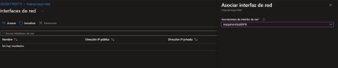
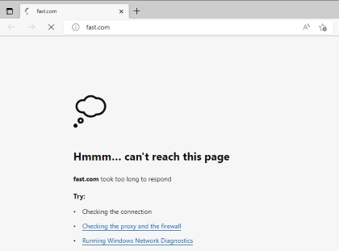

## Grupos de seguridad de red (NSG) Network Security Group

Este es seguridad a nivel de red.

- **Modelo de Servicio:** IaaS
- **Funcion:** Filtra el trafico de red desde y hacia los recursos en redes virtuales.
- **Funcion:** Estableces reglas para filtrar por puerto, direccion IP o prtocolo
- **Cuando usar:** Aislar Maquinas virtuales y hacer subredes.
- **Funcion:** Las reglas se manejas por prioridades.

-----------------------------------------------------------------------------------------

## Pasos para crear un NSG

1.- Vamos al [Portal de Azure](portal.azure.com)

2.- Vamos a crear una maquina Virtual como ya sabemos hacer.

3.- Nos vamos al apartado de redes. Y en la parte de Grupo de seguridad de red le ponemos **ninguno**

4.- Nos vamos a administraciony le deshabilitamos el diagnostico de arranque.

5.- Le damos en revisar y crear.

6.- Una ves que se cree, iremos a crear un grupo de seguridad de red.

7.- Le damos en crear y llenamos los datos.

8.- Una ves que se cree, iremos al recurso de Redes.

9.- Una ves dentro, nos vamos al apartado de interfaces de red.

10.- Le damos en asociar y seleccionamos nuestra maquina Virtual.

11.- Nos vamos a la seccion **Reglas de seguridad de entrada** y creamos una.

12.- Le movemos los intervaloes que sea **3389** que es el intervalo de **RDP**, en prioridad le ponemos **300** que sea prioridad y le añadimos un nombre.

13.- Ahora si vamos a nuestra maquina virtual, nos vamos a la seccion conectar y descargamos el RDP.

 **Esto nos dara completo acceso donde nos pedira el usuario y la contraseña, aunque desativamos los puertos, pero gracias a la regla de entrada, tenemos acceso.**

14.- Y podremos ver que si nos conecta a a la maquina virtual.

**Ahora vamos a bloquearle el internet a la maquina virtual, agregandole una regla de salida.**

15.- Nos vamos a la seccion de reglas de salida.

16.- Le damos en agregar, en destino le ponemos **Service Tag**,en servicio de destino ponemos **internet**, en intervalo ponemos un *, en Protocolo ponemos **TCP**, en accion ponemos **denegar**, le agregamos una prioridad y un nombre.

17.- Y esta lista, la regla de salida

18.- Ahora, nos regresamos a nuestra maquina virtual, abriremos el buscador y podremos ver que efectivamente ahora no tenemos internet.

19.- Y listo, con esto podemos bloquear ataques de hacker o demas cosas, agrenado diferentes reglas de salida o de entrada.

----------------------------------------------------------------------------------
